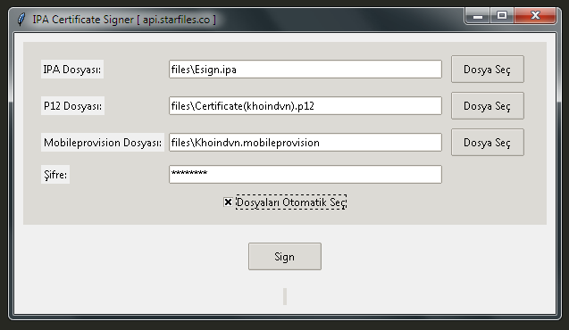

# IPA Certificate Signer



This application is a tool that automates the workflow of signing .ipa, .p12, and .mobileprovision files for iOS applications by uploading them and signing them with a password.

## Installation

1. Clone the project:

    ```bash
    git clone https://github.com/your_username/IPA_Certificate_Signer.git
    ```

2. Install the required Python libraries:

    ```bash
    pip install -r requirements.txt
    ```

## Usage

1. Run the application:

    ```bash
    python main.py
    ```

2. Add IPA, P12, and Mobileprovision files to their respective fields or check the "Auto Select Files" option.
3. Enter the password.
4. Click the "Sign" button to start the process.

## Screenshots

[Add screenshots]

## License

This project is licensed under the MIT License - see the [LICENSE](LICENSE) file for details.

---

# IPA Certificate Signer


Bu uygulama, iOS uygulamaları için .ipa, .p12 ve .mobileprovision dosyalarını yükleyerek ve bir şifre ile imzalayarak iş akışını otomatikleştiren bir araçtır.

## Kurulum

1. Projeyi klonlayın:

    ```bash
    git clone https://github.com/your_username/IPA_Certificate_Signer.git
    ```

2. Gerekli Python kütüphanelerini yükleyin:

    ```bash
    pip install -r requirements.txt
    ```

## Kullanım

1. Uygulamayı çalıştırın:

    ```bash
    python main.py
    ```

2. IPA, P12 ve Mobileprovision dosyalarını ilgili alanlara ekleyin veya "Dosyaları Otomatik Seç" seçeneğini işaretleyin.
3. Şifreyi girin.
4. "Sign" düğmesine tıklayarak işlemi başlatın.

## Ekran Görüntüleri

[Ekran görüntüsü ekleyin]

## Lisans

Bu proje MIT lisansı altında lisanslanmıştır. Daha fazla bilgi için LICENSE dosyasına bakın.
